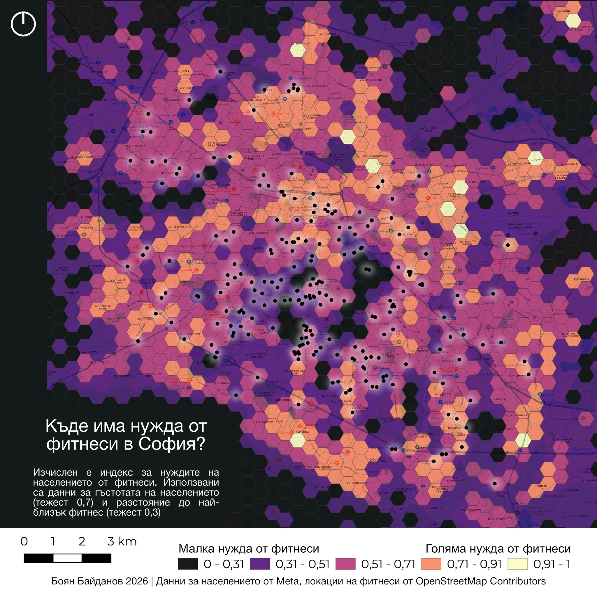

## 👋 Welcome to My Portfolio

I am a **Geospatial Systems and Technologies student at Sofia University**, focused on **spatial data analysis, GIS engineering, and geospatial automation**.  
My main interests lie at the intersection of **GIS, programming, and intelligent decision-making**, with a strong focus on **urban analytics and digital city twins**.

I enjoy working with **real-world spatial data**, combining **raster and vector analysis**, spatial databases, and Python-based workflows to extract meaningful insights and support data-driven decisions.

📍 **Interests:** GIS Engineering · Spatial Analysis · Urban Analytics · Digital Twins · Data Visualization

[LinkedIn](https://www.linkedin.com/in/bbaidanoff/) | [Email](mailto:bbaidanoff2@gmail.com)

---

## 📊 Selected Projects

### 🏋️ Fitness Accessibility Index – Sofia, Bulgaria
**GIS-based urban accessibility analysis**

Developed a composite **Fitness Accessibility Index** by integrating population density raster data with vector-based fitness location datasets.

**Key tasks:**
- Aggregated population density raster values into **hexagonal spatial grids**
- Created **heatmaps** to model fitness facility concentration
- Combined raster and vector-derived metrics into a final accessibility index
- Applied spatial joins, zonal statistics, and vector analysis

**Tools:** ArcGIS Pro · Python (GeoPandas, Pandas, NumPy) · Spatial SQL

---

### 🌍 European Economic Disparity Analysis (GDP per Capita)
**Macro-scale spatial data visualization**

Visualized Eurostat GDP-per-capita data to highlight economic disparities across Europe, focusing on clear cartographic communication and thematic mapping.

**Skills demonstrated:**
- Data normalization & classification
- Choropleth cartography
- Analytical map design for policy-oriented insights

---

### 🏙️ Market & Demographic Spatial Analysis – Gresham, Oregon
**Urban market analysis using demographic and spatial indicators**

Analyzed rental unit density in relation to age demographics to identify high-potential market zones.

**Methods used:**
- Spatial joins and buffer analysis
- Density mapping
- Demographic segmentation

---

### 🚶 NYC Pedestrian Flow Modeling
**Urban mobility & spatial density modeling**

Mapped high-traffic pedestrian corridors using NYC Open Data to identify movement patterns in dense urban environments.

**Focus areas:**
- Density analysis
- Urban network visualization
- Decision-support mapping

---

### 🛰️ Satellite Imagery & NDVI Analysis – Netherlands
**Remote sensing & raster analysis**

Processed Sentinel-2 satellite imagery to calculate NDVI and assess vegetation health.

**Techniques applied:**
- Raster preprocessing
- NDVI calculation
- Land surface classification

---

## 🛠️ Technical Skills

**Programming & Data**
- Python (GeoPandas, Pandas, NumPy)
- SQL · Spatial SQL · PostGIS

**GIS & Spatial Analysis**
- ArcGIS Pro · ArcGIS Online · StoryMaps
- QGIS
- Raster & vector analysis
- DEM & 3D terrain modeling (SRTM)

**Visualization & BI**
- Cartographic design
- Spatial data visualization
- Tableau · Power BI

**Languages**
- English – C2 Proficiency

---

📄 [Download my full CV](./CV-Bojan.pdf)
