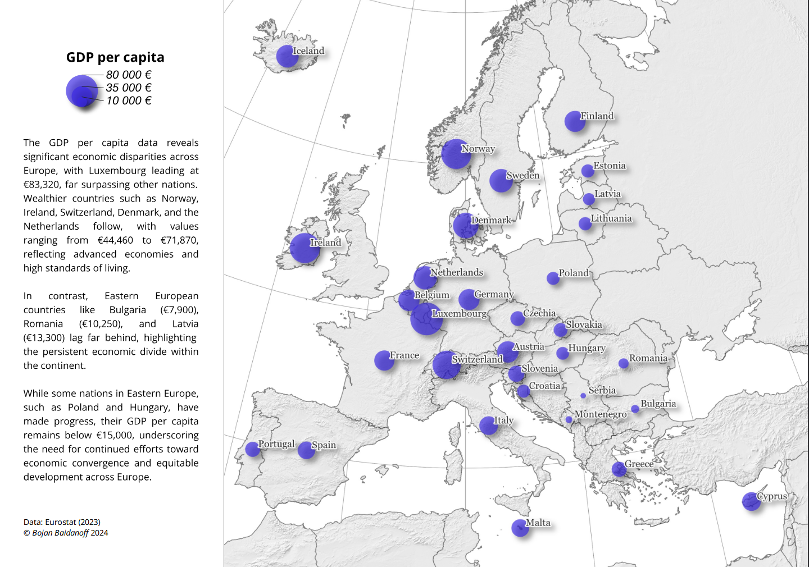
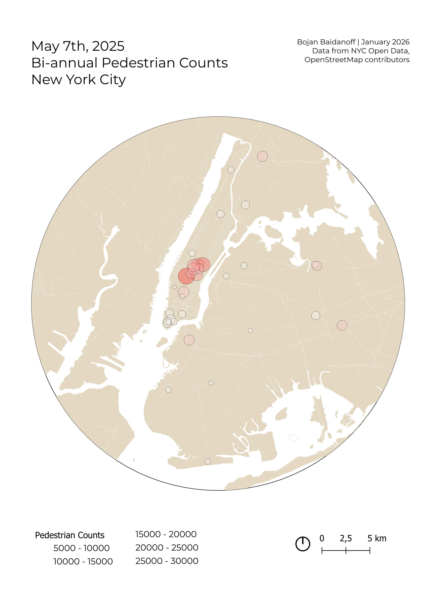

## Welcome to my Portfolio
I am a Geospatial Systems student at Sofia University with a passion for data analysis...

[LinkedIn](https://www.linkedin.com/in/bbaidanoff/) | [Email](mailto:bbaidanoff2@gmail.com)

---

### 📊 Portfolio Projects

#### 📊 European Economic Disparity Analysis (GDP per Capita)

Visualized Eurostat data to highlight the economic divide across Europe. This project demonstrates my ability to interpret macro-economic datasets and communicate findings through professional cartographic design.

#### 📍 Market & Demographic Analysis (Gresham, Oregon)
Analyzed rental density vs. age demographics to identify target marketing zones.

#### 🏙️ NYC Pedestrian Flow Modeling
Used NYC Open Data to map high-traffic urban corridors.

#### 🛰️ Satellite Imagery & NDVI (Netherlands)
Processed Sentinel-2 data for land surface classification and vegetation health.

---

### 🛠️ Technical Skills
* **Languages:** Python, SQL, R, VBA
* **Tools:** QGIS/ArcGIS, Tableau, Power BI,
* **Certifications:** C2 Proficiency English

[Download my full CV here](./CV-Bojan.pdf)